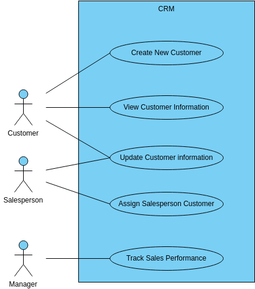

# James Helton

## Welcome!
I’m James Helton, an aspiring data analyst with a strong foundation in Python, SQL, and Tableau. As a veteran and student at the University of Tennessee, Knoxville, I’m passionate about leveraging data to solve complex problems and drive innovation.

---

### **Technical Skills**  
- **Programming Languages**: Python, SQL  
- **Data Visualization Tools**: Tableau  
- **Additional Tools**: Microsoft Excel, Microsoft Access  

---

## Education  
- **Bachelor of Science in Information Sciences**  
  - *Specialization*: Data Information Management and Analytics  
  - *Institution*: The University of Tennessee, Knoxville  

---

## About Me  
I am a dedicated student and veteran pursuing a Bachelor of Science in Information Sciences at the University of Tennessee, Knoxville. My focus is on Data Information Management and Analytics, equipping me with the tools to solve real-world problems using data.  

**Goals**:  
- Engaging in collaborative research projects  
- Successfully graduating  
- Securing a position in the data analytics field  

**Vision**:  
Aspiring to leverage analytical skills for impactful research and development initiatives that drive innovation and efficiency.  

---

## Projects  

### **Digital Monopoly Game**  
  
- **Overview**: A digital adaptation of Monopoly, emphasizing object-oriented programming and database management.  
- **Tools/Technologies Used**: Python, PostgreSQL  
- **Key Features**:  
  - Turn-based gameplay supports transactions like buying properties, paying rent, and handling bankruptcies.  
  - Normalized database design ensures efficient handling of relationships between players, properties, and spaces.  
  - Game logic automates key operations, such as property ownership changes and player elimination.  
- **Reflection**: *This project honed my ability to integrate database normalization with object-oriented design principles, preparing me for complex system development.*

---

### **Customer Tracking System**  
  
- **Overview**: Developed a customer tracking system for an internet/cable provider to manage customer profiles, service locations, equipment, and billing.  
- **Tools/Technologies Used**: Python, SQLite  
- **Key Features**:  
  - Manage customer accounts, including adding and removing customers, managing services, and updating payments.  
  - Automates overdue account tracking for efficient billing workflows.  
  - Designed an intuitive and streamlined database structure.  
- **Reflection**: *This project enhanced my database design and Python programming skills while solving a real-world business need.*

---

## Contact  
- **Email**: [jhelto20@vols.utk.edu](mailto:jhelto20@vols.utk.edu)  
- **LinkedIn**: [linkedin.com/in/James-Helton](https://www.linkedin.com/in/james-helton-267407216)  
- **Resume**: [Download Resume](https://docs.google.com/document/d/1-cPNhIXG-PDNATGf0yfN34NSq-wKiCoMMea-0pMaUPE/edit?usp=sharing)  

---

